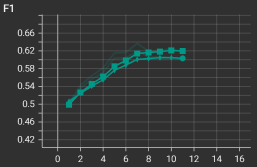
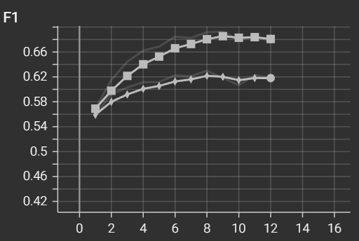
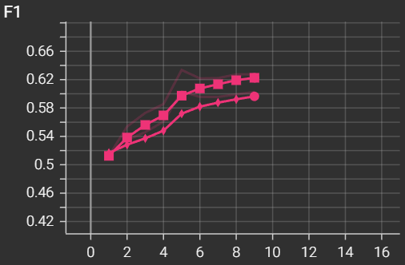
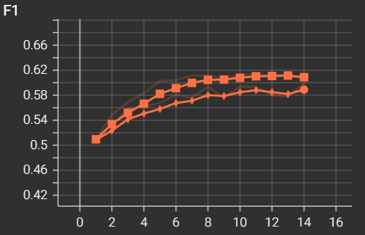
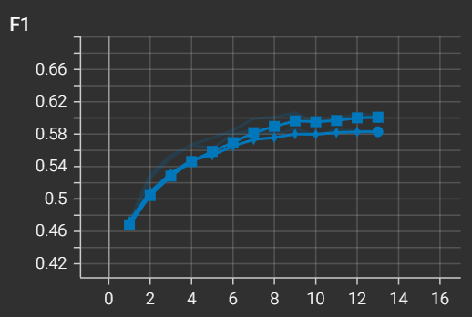
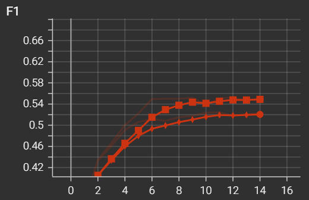
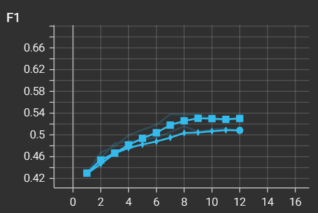

**Challenge**: MS-Coco Multi-label Classification

**Student**: Lancelot Tariot Camille, Sang Nguyen

## Table of Contents

- [I. Introduction](#i-introduction)
- [II. Model Benchmarking](#ii-model-benchmarking)
- [III. Model Architecture](#iii-model-architecture)
- [IV. Model Training](#iv-model-training)
- [V. Model Inference](#v-model-inference)
- [VI. Evaluation Metrics and Analysis](#vi-evaluation-metrics-and-analysis)
- [VII. Conclusion](#vii-conclusion)

## I. Introduction

The MS COCO multi-label classification challenge focuses on building models that can recognize multiple object categories in each MS COCO image. It emphasizes multi-label classification, transfer learning, and submitting predictions in the required format for leaderboard evaluation.

**But what does a “good” model actually mean in the context of this project?**

Instead of relying purely on leaderboard scores, we define a good model based on our own practical constraints and objectives.

In the context of multi-label image classification, a `good` model is often defined by its ability to achieve high predictive performance, typically measured by metrics such as the F1 score. However, in practical applications, a high F1 score alone is not always sufficient to determine the overall quality or suitability of a model. Other important factors include `model complexity`, `inference speed`, `training time`, and `resource efficiency`.

For this project, our goal is to identify models that not only deliver sufficiently high accuracy and F1 scores, but also maintain a lightweight architecture and fast training times.

We prioritize models that strike a balance between predictive performance and computational efficiency. In particular, we seek architectures that are compact and efficient, enabling rapid experimentation and deployment, even if this means accepting a slight trade-off in F1 score or accuracy. This approach ensures that the selected model is practical for real-world use, where speed and resource constraints are often as critical as raw performance.

## II. Model Benchmarking

### 1. Benchmarking of multiple models

In this project, we addressed the challenge of multi-label image classification on the MS-COCO dataset, where each image can contain multiple object categories simultaneously. This requires the model to predict several classes per image, rather than a single label.

To solve this, we adopted a transfer learning approach using a variety of state-of-the-art convolutional neural network backbones from torchvision:

- ConvNeXt (tiny, small, base, large)
- Swin Transformer (swin_t, swin_v2_t, etc.)
- ResNet (resnet18, resnet50)
- DenseNet
- MobileNet
- EfficientNet
- RegNet

To adapt these models for multi-label classification, we replaced the original classification head of each backbone with a custom head: a linear layer mapping to 80 output classes (corresponding to the MS-COCO label set), followed by a BatchNorm1d layer.

This design enables the model to output independent logits for each class, making it suitable for multi-label prediction.

The model selection and head replacement logic is implemented in `utils/models_factory.py`, which ensures compatibility with different backbones and allows easy switching between architectures.

### 2. Summary of Benchmarking Result

After benchmarking a wide range of backbone architectures under the same training setup, we compared their validation performance and computational cost.

The table below presents the most balanced configurations in terms of F1 score, precision–recall trade-off, and training duration. These models achieved relatively strong predictive performance while maintaining reasonable training time, making them suitable candidates according to our project-specific definition of a “good” model.

| Model              | Best Val F1 | Precision | Recall | Accuracy | Val Loss | Epochs | Duration (ms) |
| ------------------ | ----------- | --------- | ------ | -------- | -------- | ------ | ------------- |
| convnext_small     | 0.6192      | 0.5374    | 0.7303 | 0.4986   | 0.5265   | 11     | 6263378       |
| convnext_tiny (1)  | 0.6033      | 0.5458    | 0.6743 | 0.4590   | 0.5409   | 9      | 2865583       |
| convnext_tiny (2)  | 0.5995      | 0.5371    | 0.6783 | 0.4923   | 0.5143   | 14     | 3289848       |
| swin_v2_t          | 0.5866      | 0.5423    | 0.6388 | 0.4241   | 0.5088   | 13     | 5702213       |
| regnet_y_800mf     | 0.5245      | 0.5237    | 0.5253 | 0.3886   | 0.5694   | 14     | 1879095       |
| mobilenet_v3_large | 0.5160      | 0.5164    | 0.5157 | 0.3445   | 0.5805   | 12     | 1238668       |

ConvNeXt Small achieved the highest F1 score, while the Tiny versions trained faster but with slightly lower F1. To balance accuracy and training cost, we selected four backbones for the main training: ConvNeXt, MobileNet, Swin Transformer, and RegNet.

## III. Model Architecture

Before proceeding with the training using the four selected backbones, we first present an overview of the architectural features of these models. Each backbone has distinct design principles that influence its capacity, computational cost, and suitability for multi-label classification:

#### MobileNet: Optimizing for Computational Efficiency

While traditional models like VGG and ResNet are highly accurate, they require massive computational power. MobileNet is explicitly engineered for environments with limited resources, such as mobile phones or embedded devices.

To achieve this, MobileNet replaces standard, heavy convolutions with depthwise separable convolutions. A standard convolution filters and combines inputs in a single, expensive step. MobileNet splits this into two lighter steps:

- Depthwise Convolution: Applies a single filter to each color channel independently.

- Pointwise Convolution (1x1): Linearly combines the outputs of the first step.

By decoupling the filtering and combining phases, MobileNet drastically reduces the number of calculations required, resulting in a highly efficient and fast model.

#### Swin Transformer: Mastering Scale and Resolution

Standard Vision Transformers look at the entire image at once (global self-attention). While powerful, this requires an immense amount of computation for high-resolution images. The Swin Transformer solves this by reintroducing the hierarchical structure of a CNN into the Transformer framework.

It achieves this via a Shifted Window mechanism. Instead of computing attention globally, the Swin Transformer computes it locally within small, non-overlapping windows. To ensure the network still understands the "big picture," the window boundaries are shifted in consecutive layers, allowing information to pass between adjacent windows. Additionally, it gradually merges image patches in deeper layers to build a hierarchical feature map, much like the pooling layers in a ResNet.

#### ConvNeXt: The Modernized Pure ConvNet

Following the massive success of Vision Transformers, ConvNeXt was developed to see if a purely convolutional network could achieve the same performance if designed with modern techniques.

Internally, ConvNeXt simply takes a standard ResNet architecture and incrementally updates it using design principles borrowed from the Swin Transformer. These updates include using larger kernel sizes (e.g., 7x7) to "see" larger parts of the image at once, changing the hidden layer structures, and using modernized normalization techniques. ConvNeXt proves that pure convolutions can still compete with complex self-attention mechanisms while remaining simpler to implement.

#### RegNet: Enhancing Feature Retention via Recurrent Memory

In a standard ResNet, the shortcut (residual) connections help gradients flow, which allows us to train very deep networks. However, because these connections simply add previous outputs to current ones, the network can easily overwrite or "forget" complementary spatial features from earlier layers as it gets deeper.

RegNet addresses this by attaching a Regulator Module to the ResNet backbone. This module is built using Convolutional Recurrent Neural Networks (RNNs). In this context, the RNN acts as a spatio-temporal memory bank. It continuously extracts and holds onto important complementary features from earlier layers, feeding them back into the network to prevent information loss as the image is processed deeper into the model.

Understanding these architectural differences allows us to interpret their performance during training and provides insights into how they handle multi-label predictions on MS-COCO.

## IV. Model Training

### 1. Model Training and Configuration

Training is orchestrated by `training.py` and utilizes the following workflow:

Global paths are defined in `utils/config.py`: dataset at `<project_root>/ms-coco`, pretrained weights cache at `<project_root>/pre-trained_models`, and run outputs at `<project_root>/trained_models`.

**Model Initialization**

The selected backbone (e.g. ResNet, MobileNet, EfficientNet, ConvNeXt, Swin Transformer, RegNet) is loaded with pretrained ImageNet weights. The final classifier layer is replaced with a custom head: a Linear layer followed by BatchNorm1d, outputting logits for 80 classes.

**Dataset Splitting**

The dataset is split into training and validation subsets using a seeded random split for reproducibility. The default validation split ratio is **5%** `(VAL_SPLIT=0.05)`, with the random seed set to **42** `(SEED=42)`.

**Loss Function and Class Imbalance**

The loss function is BCEWithLogitsLoss, with a computed pos_weight vector to address class imbalance. The positive weights are calculated from the training subset to ensure balanced learning across all classes.

**Backbone Freezing and Unfreezing**

Training starts with the backbone frozen `(FREEZE_BACKBONE=True by default)`, allowing only the classifier head to be trained initially. The backbone is unfrozen after 1 epoch `(UNFREEZE_BACKBONE_EPOCH=1)`, enabling full fine-tuning. There is also an option to partially unfreeze the last N layers `(UNFREEZE_LAST_N_BACKBONE_LAYERS=None for full unfreeze)`.

**Batch Sizes and Gradient Accumulation**

- When the backbone is frozen: `TRAIN_BATCH_SIZE_FROZEN=256`, `GRAD_ACCUM_STEPS_FROZEN=1`
- When the backbone is unfrozen: `TRAIN_BATCH_SIZE_UNFROZEN=16`, `GRAD_ACCUM_STEPS_UNFROZEN=4`
- Validation batch size: `VAL_BATCH_SIZE=256`

**Learning Rate and Scheduling**

Differential learning rates are used:

- Backbone: `BACKBONE_BASE_LR=1e-5`
- Head: `HEAD_BASE_LR=1e-4`
- The learning rate scheduler uses milestones at epoch 9 (`MILESTONES=(9,)`) with a decay factor of `1e-2`.

**Checkpointing and Artifacts**

The best model checkpoint is tracked by validation F1 score. For each run, the following artifacts are saved in a timestamped folder under trained_models:

- `best_model.pt` (model weights)
- `run_config.json` (full configuration and results)
- `confusion_matrix.png` (generated if missing)

The active checkpoint for inference is also updated at best_model.pt.

**Threshold Tuning**

The optimal multi-label threshold is tuned on the validation set by evaluating weighted F1 scores across candidate thresholds from `0.05` to `0.95` in steps of `0.05`.

**TensorBoard Logging**

Optionally, training and validation metrics can be logged to TensorBoard by setting `USE_TENSORBOARD=True` in training.py.

**Other Settings**

- Number of epochs: `NUM_EPOCHS=25`
- Number of workers for data loading: `NUM_WORKERS=4` (increase the value of this parameter to reduce the training time)
- Early stopping is implemented but disabled by default.

## V. Model Inference

### 1. Model Inference and Configuration

The inference process is managed by the `testing.py` script and is designed for efficient, reproducible multi-label prediction on the MS-COCO test set. The key steps and configurations are as follows:

**Model Loading**

The script loads the best model checkpoint from the path specified by MODEL_PATH (default: `best_model.pt`). The model architecture is reconstructed using the configuration saved in the checkpoint, ensuring full consistency between training and inference.

**Batch Processing**

Test images are processed in batches with a default batch size of 32 (BATCH_SIZE=32). Data loading is performed with 0 worker processes (NUM_WORKERS=0) for maximum compatibility.

**Threshold Selection**

The inference threshold for multi-label prediction is determined in the following order of precedence:

- best_threshold saved in the checkpoint (if available)
- th_multi_label argument (if provided)
- Default value in `testing.py`: 0.5 (`TH_MULTI_LABEL=0.5`)

### 2. Output format

Predictions are saved in a JSON file, mapping each image ID (filename without extension) to a list of predicted class indices.

The output filename is automatically expanded with metadata tokens (model name, F1 score, epoch, training and test settings) for traceability. The base output path is predictions.json (OUTPUT_PATH=Path("predictions.json")).

## VI. Evaluation Metrics and Analysis

The following runs were evaluated from the folders under `trained_models/`. The analysis combines the F1 evolution curves from `report_images/` (train versus validation dynamics) and the official platform metrics (accuracy, F1, precision, recall) reported after submission. Extensive run-level metrics and artifacts are available in each run folder (`trained_models/<run_name>/`) and in TensorBoard (`trained_models/tensorboard_runs/`).

### 1. Common training setup (unless stated otherwise)

All runs used differential learning rates with `backbone learning rate = 1e-5` and `head learning rate = 1e-4`, a maximum of 14 epochs, learning-rate decay factor `0.01`, validation split `0.05`, validation at every epoch, early stopping enabled (`patience = 4`, `min_delta = 0.0`), and unfrozen train batch size `16`. For runs with full backbone unfreezing, the milestone schedule was `[5, 10]`. For runs with partial backbone unfreezing, the milestone schedule was `[7]`.

### 2. Run-by-run analysis from F1 curves

#### ConvNeXt family

Run `convnext_small_20260302-085858` (`convnext-small-f1.png`) used `unfreeze_backbone_epoch = 5` and `unfreeze_last_n_backbone_layers = all` (full backbone unfreeze). The train and validation F1 curves increase steadily from roughly 0.50 and then plateau near 0.61 (train) and 0.60 (validation), with a relatively small gap. The runtime recorded in `run_config.json` is `6263.378` seconds (~104.4 minutes). On the platform, this run achieved accuracy `0.5248`, F1 `0.5904`, precision `0.4785`, and recall `0.7708`, indicating a stable but recall-oriented configuration.

Run `convnext_tiny_20260302-122332` (`convnext-tiny-f1-full-unfrozen-epoch-1.png`) used `unfreeze_backbone_epoch = 1` and `unfreeze_last_n_backbone_layers = all` (full backbone unfreeze). This run shows the strongest training growth and the largest train/validation gap, which is consistent with overfitting behavior in the curve. The runtime recorded in `run_config.json` is `4550.052` seconds (~75.8 minutes). Despite that, it produced the best official scores among all tested models: accuracy `0.5585`, F1 `0.6086`, precision `0.5041`, and recall `0.7679`.

Run `convnext_tiny_20260301-194510` (`convnext-tiny-f1-full-unfrozen-epoch-5.png`) used `unfreeze_backbone_epoch = 5` and `unfreeze_last_n_backbone_layers = all`. Compared with epoch-1 full unfreeze, the progression is smoother and less unstable, with a smaller generalization gap. The runtime recorded in `run_config.json` is `2865.583` seconds (~47.8 minutes). The platform results were accuracy `0.5079`, F1 `0.5944`, precision `0.5128`, and recall `0.7070`.

Run `convnext_tiny_20260301-134646` (`convnext-tiny-f1-3-layers-unfrozen.png`) used `unfreeze_backbone_epoch = 5` and `unfreeze_last_n_backbone_layers = 3`. Its curves are stable and consistent, with lower divergence than full unfreeze and a moderate plateau. The runtime recorded in `run_config.json` is `3289.848` seconds (~54.8 minutes), which is slower than the epoch-5 full-unfreeze ConvNeXt Tiny run (`2865.583` seconds). The reason is that this partial-unfreeze run plateaued later, so with early stopping enabled it still required more effective epochs before termination. Platform results were accuracy `0.4919`, F1 `0.5931`, precision `0.5328`, and recall `0.6688`. This is the highest-precision ConvNeXt run, with lower recall than the full-unfreeze variants.

#### Swin / RegNet / MobileNet

Run `swin_v2_t_20260301-144143` (`swint-f1.png`) used `unfreeze_backbone_epoch = 5` and `unfreeze_last_n_backbone_layers = 3`. The model converged smoothly with moderate gap and good stability. The runtime recorded in `run_config.json` is `5702.213` seconds (~95.0 minutes). Platform metrics were accuracy `0.4765`, F1 `0.5835`, precision `0.4956`, and recall `0.7093`, placing it below ConvNeXt but clearly above RegNet and MobileNet on F1.

Run `regnet_y_800mf_20260301-161704` (`regnet-f1.png`) used `unfreeze_backbone_epoch = 5` and `unfreeze_last_n_backbone_layers = 5`. The curves rise steadily but saturate at lower values than ConvNeXt/Swin. The runtime recorded in `run_config.json` is `1879.095` seconds (~31.3 minutes). Platform results were accuracy `0.3794`, F1 `0.5173`, precision `0.4974`, and recall `0.5389`.

Run `mobilenet_v3_large_20260301-164829` (`mobilenet-f1.png`) also used `unfreeze_backbone_epoch = 5` and `unfreeze_last_n_backbone_layers = 5`. It converged smoothly but remained the weakest run overall in both curve level and platform metrics. The runtime recorded in `run_config.json` is `1238.668` seconds (~20.6 minutes), which is also the fastest among the compared models. Platform metrics were accuracy `0.3252`, F1 `0.4896`, precision `0.5076`, and recall `0.4728`.

Overall, the aggregate plot (`f1-score.png`) and platform results are aligned: ConvNeXt variants are strongest, Swin is competitive but lower, and RegNet/MobileNet are clearly behind on final F1.

### 3. Platform submission metrics

Official challenge metrics per run:

| Run folder                           | Run description                                           | Runtime (s) | Accuracy | F1     | Precision | Recall |
| ------------------------------------ | --------------------------------------------------------- | ----------- | -------- | ------ | --------- | ------ |
| `convnext_small_20260302-085858`     | ConvNeXt Small, Unfreeze all backbone layers at epoch 5   | 6263.378    | 0.5248   | 0.5904 | 0.4785    | 0.7708 |
| `convnext_tiny_20260302-122332`      | ConvNeXt Tiny, Unfreeze all backbone layers at epoch 1    | 4550.052    | 0.5585   | 0.6086 | 0.5041    | 0.7679 |
| `convnext_tiny_20260301-194510`      | ConvNeXt Tiny, Unfreeze all backbone layers at epoch 5    | 2865.583    | 0.5079   | 0.5944 | 0.5128    | 0.7070 |
| `convnext_tiny_20260301-134646`      | ConvNeXt Tiny, Unfreeze 3 backbone layers at epoch 5      | 3289.848    | 0.4919   | 0.5931 | 0.5328    | 0.6688 |
| `swin_v2_t_20260301-144143`          | Swin V2 Tiny, Unfreeze 3 backbone layers at epoch 5       | 5702.213    | 0.4765   | 0.5835 | 0.4956    | 0.7093 |
| `regnet_y_800mf_20260301-161704`     | RegNet Y 800MF, Unfreeze 5 backbone layers at epoch 5     | 1879.095    | 0.3794   | 0.5173 | 0.4974    | 0.5389 |
| `mobilenet_v3_large_20260301-164829` | MobileNet V3 Large, Unfreeze 5 backbone layers at epoch 5 | 1238.668    | 0.3252   | 0.4896 | 0.5076    | 0.4728 |

### 4. F1 versus Runtime Trade-off

When prioritizing pure challenge performance, the best run is **ConvNeXt Tiny with full backbone unfreeze at epoch 1**, since it achieves the highest platform F1 (`0.6086`) and the highest accuracy (`0.5585`). However, this choice comes with higher compute cost (`4550.052 s`) and a larger train/validation gap, indicating stronger overfitting risk.

When prioritizing runtime, **MobileNet V3 Large** is the fastest option (`1238.668 s`), but this speed advantage comes with a clear loss in predictive quality (lowest F1: `0.4896`).

A practical compromise is **ConvNeXt Tiny with full backbone unfreeze at epoch 5**: it keeps a strong F1 (`0.5944`) while reducing runtime (`2865.583 s`) and improving training stability compared to epoch-1 full unfreezing. If precision is the main objective, **ConvNeXt Tiny with 3 layers unfrozen at epoch 5** is also attractive (`precision = 0.5328`) with similar overall runtime (`3289.848 s`).

For the final submission, we select the model with the highest platform F1 score, since leaderboard ranking is driven primarily by F1. In our experiments, this corresponds to **ConvNeXt Tiny with full backbone unfreezing at epoch 1** (`F1 = 0.6086`). Nevertheless, alternative models may be preferred under different objectives, such as shorter runtime, higher precision, or stronger stability/generalization behavior.

## VII. Conclusion

`ConvNeXt` variants consistently achieved the strongest performance on the MS-COCO multi-label task. ConvNeXt Tiny with full backbone unfreeze at epoch 1 gave the highest F1 (`0.6086`) and accuracy (`0.5585`), making it the best choice for leaderboard ranking.

For practical trade-offs, models like ConvNeXt Tiny (freezed at epoch 5) or ConvNeXt Tiny with partial unfreeze offer slightly lower F1 but better stability, precision, and reduced runtime. Swin, RegNet, and MobileNet performed well but lag behind in predictive performance.

Overall, selecting a backbone involves balancing F1, runtime, and training stability depending on project priorities.
